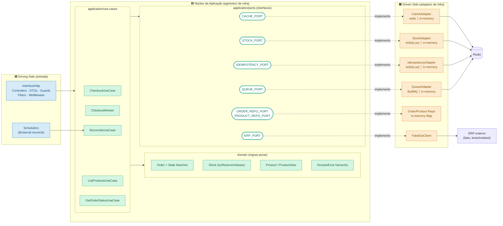
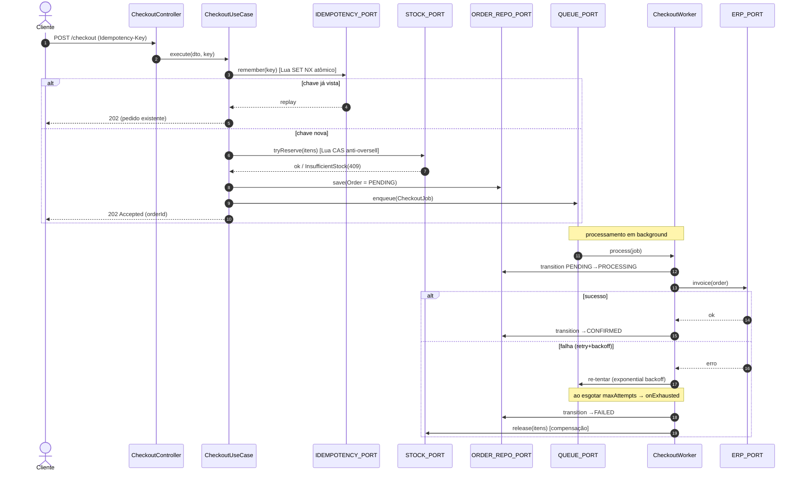
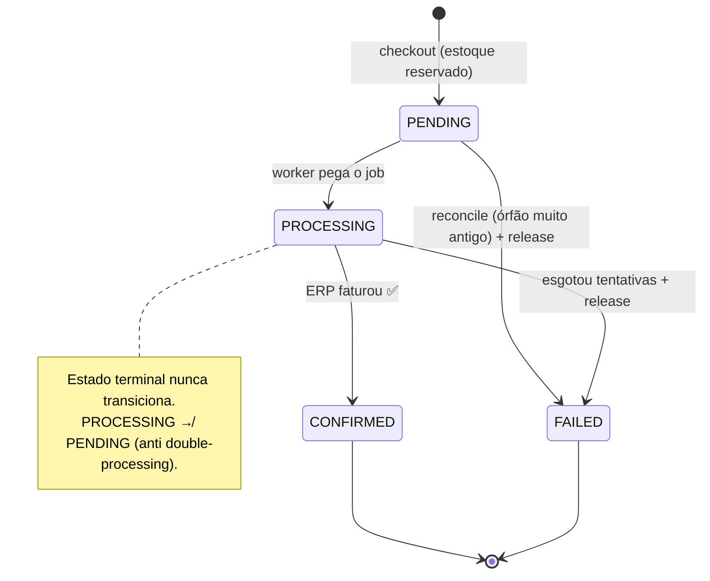
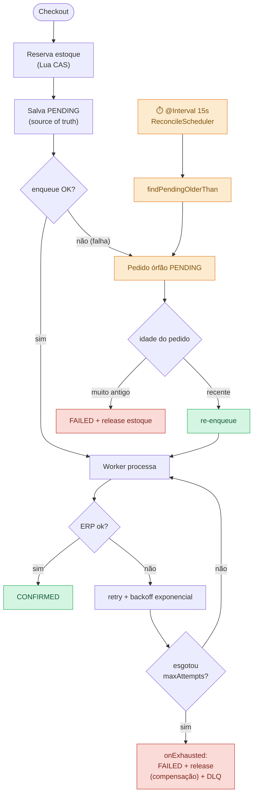
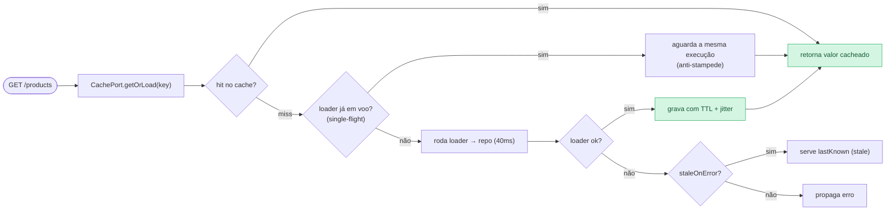

# Diagramas de Arquitetura — CaseCellShop Backend

> Diagramas em [Mermaid](https://mermaid.js.org/) (renderizam no GitHub e no VS Code com a extensão *Markdown Preview Mermaid Support*). Complementam o [`DESIGN-PATTERNS.md`](./DESIGN-PATTERNS.md).

---

## 1. Visão Hexagonal (Ports & Adapters)

Cada *capability* de infra é um **port** (interface no `application/`) com **duas implementações** (in-memory e Redis/BullMQ), selecionadas em runtime por *factory* no `infrastructure.module.ts`. O domínio não conhece HTTP nem Redis.

**Leitura:** as setas sólidas vão de fora → núcleo → ports; as setas tracejadas (`implements`) mostram a *inversão de dependência* — a infra depende dos ports, nunca o contrário.

---

## 2. Fluxo de Checkout Assíncrono (caminho feliz + 202)

O request reserva estoque atomicamente, persiste `PENDING`, enfileira e responde **202** rápido. O faturamento no ERP acontece em background.

---

## 3. Máquina de Estados do Pedido (`domain/order.ts`)

Transições válidas são definidas por construção; qualquer outra lança `InvalidOrderTransitionError`. A regra **PROCESSING nunca volta a PENDING** impede a reconciliação de re-enfileirar um pedido com worker ativo.

---

## 4. Resiliência — Outbox lógico + Reconciliação + Compensação

Como não há transação distribuída (estoque em Redis, ERP externo, sem banco transacional), a consistência é mantida por **salvar-antes-de-enfileirar** + **reconciliação periódica** + **compensação de estoque**.

---

## 5. Cache-Aside com proteção contra stampede (`ListProductsUseCase`)

---

## Legenda de cores

| Cor | Significado |
|-----|-------------|
| 🟦 Azul | Driving side — entrada (HTTP, schedulers) |
| 🟩 Verde | Núcleo da aplicação — use cases + domínio + ports (agnóstico de infra) |
| 🟧 Laranja | Driven side — adapters de infra (Redis/BullMQ/in-memory) |
| 🟥 Vermelho | Caminhos de falha / compensação |

> **Por que isto importa:** os diagramas tornam visível o princípio central do `DESIGN-PATTERNS.md` — toda dependência aponta *para dentro*, em direção ao domínio puro. É isso que permite trocar in-memory ↔ Redis sem tocar em uma linha de regra de negócio.
