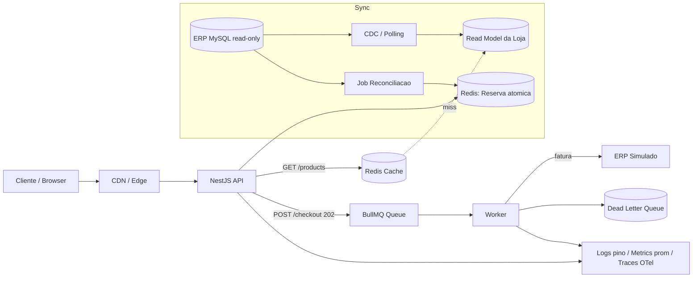
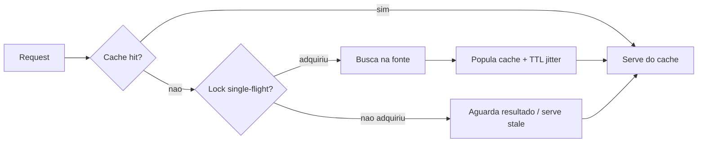
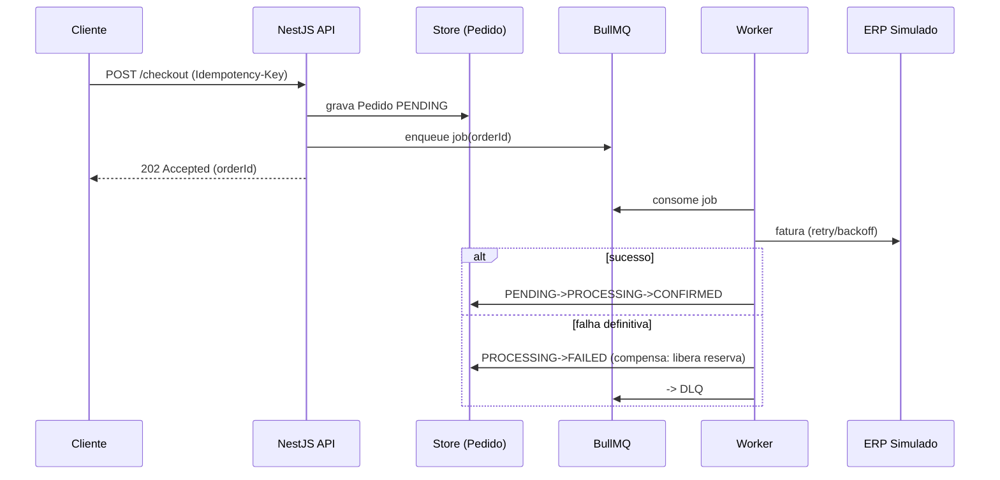
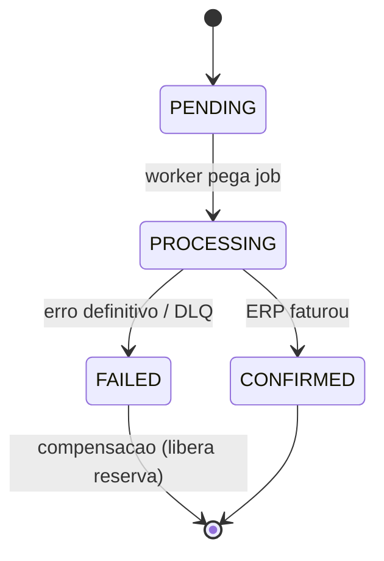

# Respostas Conceituais — Parte 1.A

**Desafio Técnico Pleno Backend — CaseCellShop**

Contexto: varejo de capinhas em hipercrescimento (milhares → milhões de acessos/dia). O ERP Central é um monolito MySQL com **acesso somente leitura** (não podemos alterar tabelas, rotinas ou código). A Loja Virtual hoje consome produtos, preços e estoque **direto do ERP via REST síncrono**. Datacenter próprio, monitoramento básico, baixa rastreabilidade.

As respostas são coerentes com a stack de implementação (Parte 1.B): **NestJS + TypeScript**, arquitetura **hexagonal (ports/adapters)**, **Redis** (cache-aside + TTL + single-flight e reserva atômica via Lua), fila **BullMQ/Redis**, **worker** simulando o ERP com retry/backoff e compensação, **idempotência** via header `Idempotency-Key`, observabilidade com **pino** (logs JSON), **prom-client** (`/metrics`) e **OpenTelemetry** (spans), e **OpenAPI** via `@nestjs/swagger`. Endpoints: `GET /products`, `POST /checkout` (202 Accepted), `GET /orders/{orderId}/status`.

---

## Pergunta 1 — Diagnóstico, trade-offs e arquitetura alvo

### Problema 01 — Performance da vitrine

**(a) Causa raiz.** A vitrine consulta o ERP **a cada acesso**, de forma síncrona e acoplada. O ERP é um monolito transacional otimizado para escrita/contabilidade, não para leitura de alta cardinalidade. Sem cache nem read model, cada pageview vira N chamadas REST ao ERP. O acoplamento síncrono propaga a latência do ERP diretamente ao cliente.

**(b) Impacto.**
- Cliente: vitrine lenta, p95 alto, abandono e conversão menor.
- Negócio: queda de receita, pior posicionamento (Core Web Vitals/SEO), perda em picos (campanhas).
- Operação: ERP sobrecarregado por carga de leitura, contaminando faturamento/financeiro; difícil escalar (read-only, não mexemos no monolito).

**(c) Caminhos.**

| Caminho | Custo | Complexidade | Latência | Consistência | Esforço |
|---|---|---|---|---|---|
| Cache distribuído (Redis cache-aside + TTL) na frente do ERP | Baixo | Baixa | Muito baixa (hit) | Eventual (limitada pelo TTL) | Baixo |
| Read model próprio da loja (projeção sincronizada do ERP) | Médio | Média/Alta | Baixa | Eventual (lag de sync) | Médio/Alto |

**Decisão:** começar por **Redis cache-aside com TTL curto + single-flight** (ganho imediato, baixo esforço) e evoluir para **read model próprio** quando a cardinalidade de queries (filtros, busca, ordenação) e o volume justificarem. São complementares: o read model alimenta o cache.

### Problema 02 — Consistência de estoque (overselling)

**(a) Causa raiz.** A checagem de estoque é um **read-then-write** (consulta o ERP, decide, e o débito real acontece depois/em outro sistema). Entre ler e confirmar há a janela **TOCTOU** (time-of-check to time-of-use): várias requisições leem o mesmo saldo e prosseguem. Como o ERP é read-only para nós, não há reserva atômica na fonte.

**(b) Impacto.**
- Cliente: compra confirmada e depois cancelada → frustração, churn.
- Negócio: chargeback, custo de SAC, dano à marca, prejuízo logístico.
- Operação: conciliação manual, cancelamentos, ruído no ERP.

**(c) Caminhos.**

| Caminho | Custo | Complexidade | Latência | Consistência | Esforço |
|---|---|---|---|---|---|
| Reserva atômica em Redis (Lua DECRBY condicional) com expiração | Baixo | Média | Muito baixa | Forte no ponto de reserva; reconciliada com ERP | Médio |
| Lock pessimista no fluxo de checkout (fila serializada por SKU) | Baixo | Média | Maior (serialização) | Forte | Médio |

**Decisão:** **reserva de estoque atômica em Redis** com TTL de expiração (libera reserva órfã), sincronizando o saldo a partir do ERP (read-only) e **reconciliando** periodicamente. Atomicidade via script **Lua** garante check-and-decrement num único passo, eliminando o TOCTOU.

### Problema 03 — Resiliência do checkout

**(a) Causa raiz.** O faturamento depende de uma chamada **síncrona e lenta** ao ERP dentro da jornada do cliente. Sem timeout/retry/assíncrono, qualquer lentidão do ERP vira erro de checkout. Falta rastreabilidade por pedido.

**(b) Impacto.**
- Cliente: checkout trava, erro no pagamento, duplo clique.
- Negócio: perda de venda no último passo (maior valor).
- Operação: sem rastreio, difícil saber se o pedido foi faturado.

**(c) Caminhos.**

| Caminho | Custo | Complexidade | Latência percebida | Consistência | Esforço |
|---|---|---|---|---|---|
| Checkout síncrono com timeout + retry | Baixo | Baixa | Alta (espera ERP) | Forte | Baixo |
| Checkout assíncrono (fila + worker, 202 Accepted) | Médio | Média | Muito baixa (resposta imediata) | Eventual (status consultável) | Médio |

**Decisão:** **assíncrono**. `POST /checkout` grava o pedido `PENDING` e responde **202 Accepted** com `orderId`; um **worker** (BullMQ) chama o ERP simulado com **retry/backoff + DLQ** e atualiza o status; o cliente acompanha via `GET /orders/{orderId}/status`.

### Visão de arquitetura alvo (30–90 dias)

- **Cache (Redis):** cache-aside com TTL curto na vitrine; single-flight para evitar stampede.
- **Fila/Worker (BullMQ/Redis):** desacopla o faturamento; retry/backoff, DLQ, idempotência.
- **Read model / banco próprio da loja:** projeção de produtos/preços/estoque otimizada para leitura, independente do ERP.
- **Sincronização do MySQL read-only:** preferir **CDC** (ex.: Debezium lendo binlog) quando disponível — não-intrusivo, ideal para read-only; fallback **polling incremental** por `updated_at`/PK; **batch** noturno para reconciliação completa.
- **Observabilidade básica:** logs JSON (pino), métricas Prometheus (`/metrics`), traces OpenTelemetry, correlation IDs ponta a ponta.
- **Reconciliação com o ERP:** job periódico compara reserva/estoque da loja vs ERP, libera reservas órfãs (`PENDING` expirado) e corrige divergências.

---

## Pergunta 2 — Cache, invalidação e performance da vitrine

### Camadas de cache e papel de cada uma

| Camada | Onde | Papel | TTL típico |
|---|---|---|---|
| CDN / Edge | Borda (assets, catálogo público) | Absorve picos, serve HTML/JSON estático e imagens; menor RTT | Minutos a horas |
| API Gateway | Entrada da API | Cache de respostas idempotentes (GET /products), rate limit | Segundos a minutos |
| Aplicação / Redis | Serviço NestJS | Cache-aside dos dados quentes (produto, preço, disponibilidade) | Segundos a minutos |
| Read model | Projeção própria | "Cache materializado" persistente, fonte para repovoar o Redis | Sincronizado por CDC/polling |

### Estratégias

- **TTL:** curto para preço/estoque (mais voláteis), maior para metadados de produto (nome, imagem). TTL com **jitter** (±10–20%) para espalhar expirações.
- **Invalidação:** por evento (CDC dispara invalidação/refresh da chave) e por TTL como rede de segurança. Versionar a chave (`product:{id}:v{n}`) facilita invalidação em lote.
- **Cache-aside vs refresh-ahead:** **cache-aside** (lê do cache; miss → busca na fonte e popula) é o padrão da vitrine — simples e resiliente. **refresh-ahead** (renova proativamente antes de expirar) vale para os top SKUs (alto tráfego), evitando miss em itens quentes.
- **Fallback:** **stale-while-revalidate** (serve dado levemente vencido enquanto revalida em background) e **stale-while-error** (se a fonte/ERP cair, serve o último valor bom em vez de erro). Limitar a idade máxima do stale para não servir dado muito antigo.
- **Cache muito antigo:** limitar `max-stale`, expor `Age` e descartar acima de um teto; CDC reduz a janela de defasagem.
- **Cache stampede:** **single-flight / request coalescing** (uma só busca à fonte por chave; demais aguardam), **lock distribuído curto** na repopulação e **jitter no TTL**. Na implementação, o `GET /products` usa cache-aside com **single-flight** para que um miss simultâneo não dispare N chamadas ao ERP.

### Métricas para validar

**(a) Performance/custo:**
- `cache_hit_ratio` (hits / (hits+misses)) — alvo alto (ex.: > 90%).
- `http_request_duration_seconds` p95/p99 do `GET /products`.
- `erp_calls_total` por request — taxa de offload (quanto o cache poupou do ERP).

**(b) Não está servindo dado velho/incorreto:**
- `cache_staleness_ratio` — fração de respostas servidas como stale.
- `cache_served_age_seconds` (histogram) — idade do dado servido.
- `cache_source_divergence_total` — divergências detectadas entre cache e fonte (amostragem/reconciliação).
- `cache_revalidation_total{result}` — revalidações ok/erro.

---

## Pergunta 3 — Observabilidade (Datadog/Prometheus/OTel)

Objetivo: detectar **degradação** e **furos de estoque** antes das reclamações, sem conta paga (usamos pino + prom-client + OpenTelemetry).

### (a) Logs estruturados (JSON, pino)

Campos **obrigatórios** em todo log:

| Campo | Descrição |
|---|---|
| `timestamp` | ISO 8601 |
| `level` | info/warn/error |
| `service` | nome do serviço |
| `correlationId` / `requestId` | rastreio ponta a ponta (propagado da borda) |
| `traceId` / `spanId` | correlação com OpenTelemetry |
| `route` / `method` | endpoint |
| `statusCode` | resposta HTTP |
| `latencyMs` | duração |

Campos por domínio: `orderId`, `productId`, `qty`, `idempotencyKey`, `cacheResult` (hit/miss/stale), `reservationResult` (ok/insufficient), `erpStatus`, `attempt`, `queueJobId`. **Nunca** logar dados sensíveis (PII de pagamento).

### (b) Métricas

**Cache:** `cache_requests_total{result}` (counter, **emitido pela aplicação**); `cache_hit_ratio` e `cache_served_age_seconds` são **derivados** dele em PromQL/Datadog (não são séries próprias).
**Checkout:** `checkout_requests_total{status}` (counter), `checkout_inflight` (gauge), `checkout_duration_seconds` (histogram).
**Fila/Worker:** `worker_jobs_total{result}` (counter: completed/failed/retried/dlq), `queue_depth` (gauge), `queue_wait_seconds` / `worker_duration_seconds` (histogram), `worker_retries_total` (counter).
**Estoque:** `stock_reservation_total{result=ok|insufficient}` (counter), `stock_available` (gauge por SKU quente), `oversell_prevented_total` (counter).
**ERP:** `erp_calls_total{result}` (counter), `erp_call_duration_seconds` (histogram), `erp_timeouts_total` (counter).

### (c) Traces / spans

`GET /products`:
- `http.request` → `cache.get` → (miss) `lock.acquire` → `readmodel.query` / `erp.fetch` → `cache.set`.

`POST /checkout` (assíncrono):
- `http.request` → `idempotency.check` → `stock.reserve` (Lua) → `order.persist (PENDING)` → `queue.enqueue` → resposta 202.
- Worker (trace separado, ligado por `correlationId`): `worker.process` → `erp.invoice` (com `attempt`) → `order.transition` → (erro) `compensation.release` / `dlq.publish`.

### (d) SLI/SLO, alertas e dashboard

**SLIs/SLOs:**
- Disponibilidade `GET /products` ≥ 99.9%.
- Latência `GET /products` p95 < 200 ms.
- Latência `POST /checkout` (resposta 202) p95 < 300 ms.
- Tempo até confirmação do pedido (enqueue→CONFIRMED) p95 < 30 s.
- `oversell_prevented_total` exposto; saldo nunca negativo (erro hard se ocorrer).

**Alertas:** p95 acima do SLO por 5 min; `cache_hit_ratio` < 80%; `queue_depth` crescente / `queue_wait_seconds` p95 alto; `erp_timeouts_total` em alta; jobs em DLQ > 0.

**Dashboard (painéis):**
1. Tráfego e latência (RPS, p50/p95/p99 por rota).
2. Cache (hit ratio, idade do dado, staleness, offload do ERP).
3. Checkout (taxa de 202, erros, inflight).
4. Fila/Worker (depth, wait, processing, retries, DLQ).
5. Estoque (reservas ok/insuficiente, oversell evitado, saldo dos top SKUs).
6. ERP (latência, timeouts, error rate) — dependência externa.

---

## Pergunta 4 — Concorrência, estoque e idempotência

### Por que read-then-write é insuficiente

`SELECT stock` → aplicação decide → `débito` é uma sequência **não atômica**. Entre o check e o use há a janela **TOCTOU**: duas requisições concorrentes leem `stock=1`, ambas aprovam, ambas debitam → **overselling**. É uma condição de corrida clássica; resolver exige atomicidade ou serialização no ponto de decisão.

### Comparação de mecanismos

| Mecanismo | Como funciona | Prós | Contras | Quando usar |
|---|---|---|---|---|
| Atomic update condicional (`UPDATE ... WHERE stock>=qty` / Redis Lua DECRBY) | Check + decremento num único passo atômico | Sem race; alta performance; simples | Precisa do contador numa fonte controlável (Redis) | **Escolha padrão** — reserva na loja (Redis Lua) |
| Lock pessimista (`SELECT ... FOR UPDATE`) | Bloqueia a linha durante a transação | Forte consistência | Serializa, contenção, deadlock; inviável no ERP read-only | DB transacional próprio, contenção baixa |
| Reserva com expiração | Reserva atômica + TTL; confirma no faturamento | Tolera abandono; libera órfãos | Precisa job de expiração/reconciliação | Checkout assíncrono (nosso caso) |
| Distributed lock (Redlock) | Lock distribuído por chave (SKU) | Serializa cross-instância | Complexo, risco de clock skew, overhead | Seção crítica não-atômica entre serviços; evitar se update atômico resolve |

**Decisão:** **reserva atômica via Redis Lua DECRBY condicional, com TTL de expiração**. O script garante check-and-decrement atômico (resolve TOCTOU sem lock global) e o TTL libera reservas órfãs; a reconciliação com o ERP (read-only) ajusta o saldo base.

### Idempotência

- **Idempotency-Key:** o cliente envia `Idempotency-Key` no `POST /checkout`; o servidor guarda chave → `orderId` num **dedupe store** (Redis `SET NX`). Reenvio com a mesma chave retorna o mesmo pedido, sem criar outro.
- **Duplo clique / retry de rede:** mesma chave → mesma resposta (não duplica reserva nem pedido).
- **Reprocessamento no worker:** jobs idempotentes — a transição de estado é condicional (só avança a partir do estado esperado); reprocessar job já confirmado é no-op.

### Como testaria (no escopo do desafio)

Teste de concorrência: estoque inicial `M`, disparar `N > M` requisições de checkout **em paralelo** para o mesmo SKU.

Asserções:
- Exatamente `M` checkouts obtêm reserva; os outros `N-M` recebem 409 "sem estoque".
- `stock_available` final = 0 (nunca negativo).
- `oversell_prevented_total` reflete as tentativas rejeitadas.
- Repetição com a mesma `Idempotency-Key` não consome estoque adicional.

Implementação: usar os adapters in-memory/Redis da arquitetura hexagonal, `Promise.all` com N requisições e asserções determinísticas no estado final.

---

## Pergunta 5 — Mensageria, resiliência, contrato e IA

### Publicar na fila antes ou depois de gravar o pedido?

**Depois de gravar o pedido (PENDING), nunca antes.** Publicar antes de persistir cria risco de **mensagem-fantasma**: a fila recebe um job para um pedido que pode nunca existir (se a gravação falhar). Persistir antes e enfileirar depois evita isso. O risco residual inverso é o **pedido-fantasma**: pedido gravado mas a publicação falhou — pedido que nunca é processado.

Isso é o **dual-write problem**: gravar no DB e publicar na fila são dois sistemas; sem coordenação podem divergir. A solução canônica é o **padrão Outbox**: na mesma transação grava-se o pedido `PENDING` e um registro `outbox`; um relay publica o outbox na fila com garantia at-least-once. No escopo do desafio (Redis/BullMQ), aproximamos com: **gravar PENDING → enfileirar → reconciliar PENDING órfãos**.

Mitigações de ambos os riscos:
- Gravar pedido **PENDING antes** de enfileirar.
- **Worker idempotente** (at-least-once + dedupe) tolera mensagem entregue mais de uma vez.
- **Reconciliação** periódica varre `PENDING` órfãos (sem job correspondente) e reenfileira ou marca falha.
- **Dead-letter (DLQ)** para jobs que esgotam tentativas.

### Estratégia de retry

- **Backoff exponencial + jitter** (ex.: base 0,5s, fator 2, jitter aleatório) para evitar thundering herd.
- **max attempts** (ex.: 3–5); ao esgotar → **DLQ**.
- Distinguir erros **retriáveis** (timeout, 5xx, indisponibilidade) de **não-retriáveis** (validação) — estes vão direto a `FAILED`.

### Máquina de estados do pedido

Transições **idempotentes** e condicionais (só avança a partir do estado esperado). **Compensação** em `FAILED`: liberar a reserva de estoque e registrar o motivo.

### Papel do OpenAPI no contrato

`@nestjs/swagger` gera o **OpenAPI** como contrato fonte-da-verdade: documenta `GET /products`, `POST /checkout` (202, header `Idempotency-Key`) e `GET /orders/{orderId}/status` (enum de status), com schemas de sucesso e erro. Habilita validação de request/response, geração de clients e testes de contrato — alinha front, back e QA.

### Abordagem de testes

- **Unitários:** lógica de reserva atômica, máquina de estados, idempotência (adapters in-memory).
- **Concorrência:** N>M paralelos sem overselling (Pergunta 4).
- **Integração:** fluxo checkout→worker→status; com Redis/BullMQ via docker-compose (e2e opcional).
- **Resiliência:** simular timeout/erro do ERP → verificar retry, DLQ e compensação.
- **Contrato:** validar respostas contra o schema OpenAPI.

### Uso responsável de IA

- **PROMPTS.md** versionado: registra prompts usados, o que foi gerado por IA e o que foi ajustado manualmente — transparência e reprodutibilidade.
- **Revisão crítica:** toda saída de IA é revisada (corretude, segurança, aderência à arquitetura hexagonal e à stack); nenhum código entra sem entendimento e teste. IA acelera; a responsabilidade de engenharia permanece humana.

---

## Glossário de Conceitos

> Esta seção explica, em linguagem acessível, os termos técnicos usados nas respostas acima. A ideia é que qualquer leitor — mesmo sem familiaridade com toda a nomenclatura — entenda **o que é**, **por que importa** e **onde aparece** no desafio. A seção seguinte ("Por que cada decisão?") complementa, explicando o *motivo* de cada escolha.

### Cache e performance

**Cache-aside (lazy loading)**
A aplicação pergunta primeiro ao cache. Se o dado está lá (*hit*), responde na hora. Se não está (*miss*), ela busca na fonte (ERP ou read model), guarda uma cópia no cache e responde. *Analogia:* anotar um telefone num post-it; só procura na agenda completa quando o post-it não tem. **Por que importa:** se o cache cair, a aplicação continua funcionando (só fica mais lenta), porque ela sabe buscar na fonte.

**Hit / Miss**
*Hit* = o dado estava no cache. *Miss* = não estava, precisou ir à fonte. A razão entre eles (`cache_hit_ratio`) mede a eficiência do cache; quanto mais alta, menos o ERP é incomodado.

**TTL (Time To Live)**
"Prazo de validade" de cada item no cache. Quando vence, o item é descartado e a próxima leitura repopula. Curto para dados que mudam muito (preço, estoque); longo para dados estáveis (nome, foto do produto).

**Jitter no TTL**
Pequena variação aleatória no prazo de validade (ex.: ±15%). *Por quê:* se 10.000 itens entram no cache no mesmo segundo com TTL idêntico, todos expiram juntos e a aplicação leva uma enxurrada de misses simultâneos. O jitter "espalha" as expirações no tempo.

**Cache stampede (debandada / thundering herd)**
Um item muito acessado expira e, no mesmo instante, centenas de requisições dão *miss* ao mesmo tempo — todas correm para o ERP de uma vez e o derrubam. É o problema que o jitter e o single-flight previnem.

**Single-flight (request coalescing)**
Quando várias requisições dão *miss* na mesma chave ao mesmo tempo, **apenas uma** vai buscar na fonte; as demais esperam e reaproveitam o mesmo resultado. *Analogia:* numa sala, uma pessoa pergunta "que horas são?" e todos ouvem a resposta — ninguém precisa perguntar de novo.

**Refresh-ahead**
Renovar o item no cache **antes** de ele vencer, de forma proativa (vale a pena para os produtos campeões de venda). Assim o cliente nunca pega o *miss*.

**Stale-while-revalidate (SWR)**
Servir um dado **levemente vencido** imediatamente, enquanto, em segundo plano, o sistema busca a versão nova. O cliente tem resposta rápida e o dado se atualiza logo em seguida. ("Stale" = velho/vencido.)

**Stale-while-error (SWE)**
Se a fonte (ERP) está fora do ar, servir o **último valor bom conhecido** em vez de devolver erro. Melhor mostrar um preço de 2 minutos atrás do que uma tela quebrada.

**Read model (modelo de leitura)**
Um banco de dados **próprio da loja**, montado e otimizado só para leitura, que espelha os dados do ERP. Funciona como um "cache materializado" persistente. Separa o lado que lê (vitrine, alto volume) do lado que escreve (ERP, transacional) — ideia central do padrão **CQRS** (*Command Query Responsibility Segregation*).

**CDN / Edge**
Servidores espalhados geograficamente, perto do usuário, que guardam conteúdo estático (imagens, catálogo). Reduzem a distância física (latência) e absorvem picos antes mesmo de a requisição chegar à API.

### Estoque e concorrência

**Condição de corrida (race condition)**
Quando o resultado depende da **ordem/tempo** em que operações concorrentes acontecem, e essa ordem não é controlada. Duas pessoas tentando comprar a última peça ao mesmo tempo é o exemplo clássico.

**TOCTOU (Time-Of-Check To Time-Of-Use)**
A "janela perigosa" entre **verificar** (check: "tem estoque?") e **usar** (use: "debita"). Se outra requisição se intromete nessa janela, ambas acham que há estoque e ambas vendem → **overselling**. *Analogia:* dois caixas conferindo o mesmo ingresso disponível e ambos vendendo a mesma poltrona.

**Overselling**
Vender mais unidades do que existem em estoque. O problema central de consistência que o desafio precisa evitar.

**Read-then-write**
O padrão problemático: *ler* o estoque → *decidir* na aplicação → *escrever* o débito, em três passos separados. Por não ser atômico, abre a janela TOCTOU.

**Operação atômica**
Algo que acontece de forma **indivisível**: ou ocorre por inteiro, ou não ocorre — nada se intromete no meio. Fazer "verificar e decrementar" num único passo atômico elimina o TOCTOU.

**Script Lua no Redis**
O Redis executa scripts na linguagem Lua de forma **atômica** (um de cada vez, sem interrupção). Por isso um `DECRBY` condicional ("se saldo ≥ quantidade, subtraia") dentro de um script Lua resolve a reserva de estoque sem risco de corrida.

**Reserva com expiração**
Em vez de debitar definitivo, "segura" a quantidade temporariamente, com prazo (TTL). Se o cliente abandona o checkout, o prazo vence e a reserva volta sozinha para o estoque (a "reserva órfã" é liberada). A baixa definitiva só acontece no faturamento.

**Lock pessimista (`SELECT ... FOR UPDATE`)**
"Tranca" a linha do banco enquanto uma transação a usa; ninguém mais mexe até ela terminar. Garante consistência forte, mas **serializa** o acesso (um por vez → lento sob alta concorrência) e pode causar *deadlock*. Inviável aqui porque o ERP é somente-leitura.

**Distributed lock / Redlock**
Um "cadeado" compartilhado entre várias instâncias da aplicação, identificado por uma chave (ex.: o SKU do produto). Serializa o acesso entre máquinas diferentes, mas é complexo e sensível a relógios dessincronizados (*clock skew*). O documento prefere evitá-lo quando a operação atômica já resolve.

**Reconciliação**
Tarefa periódica que **compara** o estado da loja (reservas, saldos) com o ERP e corrige diferenças, além de liberar reservas que ficaram presas. É a "rede de segurança" que conserta pequenas divergências que escapam.

### Resiliência, filas e mensageria

**Síncrono vs assíncrono**
*Síncrono:* o cliente **espera** a operação inteira terminar (se o ERP demora, o cliente sofre a demora). *Assíncrono:* a aplicação aceita o pedido, responde "recebido, estou processando" e faz o trabalho pesado depois, em segundo plano.

**202 Accepted**
Código HTTP que significa "**aceitei seu pedido, mas ainda não terminei**". É a resposta do checkout assíncrono: devolve um `orderId` na hora; o cliente consulta o status depois. Diferente do 200 OK, que significa "pronto, concluído".

**Fila (queue) e Worker**
A **fila** (BullMQ sobre Redis) é uma "lista de tarefas a fazer". O **worker** é o processo que, em segundo plano, pega tarefas da fila e as executa (chamar o ERP, faturar). Isso **desacopla** o trabalho lento da resposta ao cliente.

**Dual-write problem (problema da escrita dupla)**
Quando uma ação precisa gravar em **dois sistemas diferentes** (o banco do pedido **e** a fila) e não há como garantir que ambos deem certo juntos. Se um falha e o outro não, os sistemas divergem. Daí a regra: **gravar o pedido primeiro, enfileirar depois**.

**Mensagem-fantasma vs pedido-fantasma**
Os dois jeitos de o dual-write dar errado: *mensagem-fantasma* = a fila recebeu um job para um pedido que nunca chegou a existir. *Pedido-fantasma* = o pedido foi gravado, mas a mensagem nunca foi enfileirada (pedido que ninguém processa).

**Padrão Outbox**
A solução canônica do dual-write. Na **mesma transação** do banco, grava-se o pedido **e** um registro numa tabela `outbox`. Depois, um processo separado (relay) lê a `outbox` e publica na fila. Como tudo que importa está numa única transação, não há divergência. *Analogia:* anotar a carta numa caixa de saída; o carteiro recolhe depois, mas o registro já está garantido.

**At-least-once (ao menos uma vez)**
Garantia de entrega das filas: a mensagem **chega pelo menos uma vez**, mas pode chegar repetida. Por isso o worker precisa ser idempotente (ver abaixo) — processar a mesma mensagem duas vezes não pode causar dano.

**Idempotência**
Propriedade de uma operação que, repetida várias vezes, produz **o mesmo efeito de uma vez só**. *Analogia:* apertar o botão do andar no elevador 5 vezes é igual a apertar 1 vez. No checkout, garante que duplo clique ou retry de rede não criem dois pedidos.

**Idempotency-Key**
Um identificador único que o cliente envia junto do checkout. O servidor guarda "esta chave → este pedido". Se a mesma chave chegar de novo, devolve o pedido já existente em vez de criar outro.

**`SET NX` (Set if Not eXists)**
Comando atômico do Redis que só grava se a chave ainda não existir. É a peça que implementa a deduplicação da Idempotency-Key.

**Retry com backoff exponencial + jitter**
*Retry:* tentar de novo quando falha. *Backoff exponencial:* esperar intervalos cada vez maiores entre tentativas (0,5s → 1s → 2s → 4s) para não martelar um sistema já sobrecarregado. *Jitter:* somar aleatoriedade a essas esperas para que muitos workers não tentem todos no mesmo instante.

**Max attempts**
Limite de tentativas. Depois de N falhas, para de tentar e manda a tarefa para a DLQ — em vez de ficar tentando para sempre.

**DLQ (Dead Letter Queue / fila de mensagens mortas)**
"Quarentena" para tarefas que falharam todas as tentativas. Ficam lá para um humano investigar, sem travar a fila principal nem se perder.

**Erro retriável vs não-retriável**
*Retriável:* falha temporária (timeout, ERP fora do ar, erro 5xx) — tentar de novo pode funcionar. *Não-retriável:* falha permanente (dado inválido) — repetir não adianta, vai direto para `FAILED`.

**Máquina de estados**
O conjunto de estados pelos quais um pedido passa e as transições válidas entre eles: `PENDING → PROCESSING → CONFIRMED` (ou `→ FAILED`). Modelar assim impede transições inválidas (ex.: um pedido "saltar" para CONFIRMED sem passar por PROCESSING).

**Compensação / Padrão Saga**
Em sistemas distribuídos não há um "desfazer" global. Quando um passo falha, executa-se uma **ação compensatória** que reverte o efeito anterior — aqui, **liberar a reserva de estoque** de um pedido que falhou. A sequência de "ação + compensação" é o padrão **Saga**.

### Observabilidade

**Observabilidade — os 3 pilares**
Capacidade de entender o que acontece dentro do sistema a partir do que ele emite: **logs** (o que aconteceu), **métricas** (quanto/quantas vezes) e **traces** (o caminho de uma requisição). Juntos, permitem detectar problemas antes das reclamações.

**Logs estruturados (JSON)**
Logs gravados como dados organizados (campos `timestamp`, `level`, `latencyMs`...) em vez de texto solto. *Por quê:* máquinas conseguem filtrar, agrupar e alertar sobre eles. A biblioteca **pino** gera esses logs em JSON com alto desempenho.

**Correlation ID / Request ID**
Um identificador único atribuído a cada requisição e **propagado por todos os serviços** que ela toca (da borda até o worker). Permite reconstruir a história completa de "o que aconteceu com o pedido X" filtrando por um único ID.

**Métricas: Counter, Gauge, Histogram**
Os três tipos do Prometheus. *Counter:* só aumenta (ex.: total de chamadas ao ERP). *Gauge:* sobe e desce, é um valor instantâneo (ex.: tamanho atual da fila). *Histogram:* registra a distribuição dos valores (ex.: durações), permitindo calcular percentis.

**Métrica derivada**
Uma métrica **calculada** a partir de outra, em vez de ser coletada diretamente. Ex.: `cache_hit_ratio` é derivada do counter `cache_requests_total{result=hit|miss}` via fórmula no Prometheus — a aplicação não precisa publicá-la separadamente.

**Percentis (p50 / p95 / p99)**
Forma de medir latência sem ser enganado pela média. *p95 = 200ms* significa "95% das requisições foram mais rápidas que 200ms; os 5% piores foram mais lentos". Revela a experiência do usuário azarado, que a média esconde.

**Trace e Span (OpenTelemetry)**
Um **trace** é a jornada completa de uma requisição pelo sistema. Cada etapa dessa jornada é um **span** (`cache.get`, `erp.fetch`...), com início, fim e duração. Visualizados em cascata, mostram exatamente onde o tempo foi gasto.

**SLI / SLO**
*SLI (Service Level Indicator):* a métrica que se mede (ex.: latência p95 da vitrine). *SLO (Service Level Objective):* a **meta** para essa métrica (ex.: p95 < 200ms; disponibilidade ≥ 99,9%). Quando o SLI viola o SLO por um tempo, dispara um alerta.

### Arquitetura e contrato

**Arquitetura hexagonal (ports & adapters)**
Estilo que isola o **núcleo de negócio** da infraestrutura. *Ports* são interfaces ("preciso de um lugar para guardar reservas"); *adapters* são as implementações concretas (Redis, memória, ERP simulado). *Benefício:* nos testes, troca-se o adapter Redis por um em memória sem tocar na lógica de negócio.

**CDC (Change Data Capture)**
Técnica para capturar **mudanças** de um banco lendo seu log interno de transações (o *binlog* do MySQL), em vez de ficar consultando-o repetidamente. É **não-intrusivo** — perfeito para um ERP somente-leitura — e mantém o read model atualizado quase em tempo real. Ferramenta típica: Debezium.

**Polling incremental**
Alternativa ao CDC quando ele não está disponível: consultar periodicamente "o que mudou desde a última vez?" usando um campo como `updated_at`. Mais simples, porém menos imediato e mais custoso.

**OpenAPI (contrato fonte-da-verdade)**
Documento padronizado que descreve **toda a API** (rotas, parâmetros, formatos de resposta, códigos de erro). Gerado a partir do código pelo `@nestjs/swagger`, serve como "contrato" oficial entre front-end, back-end e QA, e habilita validação automática, geração de clientes e testes de contrato.

**PII (Personally Identifiable Information)**
Dados pessoais sensíveis (ex.: dados de pagamento). O documento ressalta que **nunca** devem aparecer em logs.

---

## Por que cada decisão? — Justificativa das escolhas

> Esta seção não define os termos (isso é o Glossário acima): explica **por que cada técnica foi escolhida** neste projeto, qual problema concreto ela resolve e **por que não a alternativa**. É o raciocínio de engenharia por trás de cada decisão das respostas acima.

### Cache e performance da vitrine

**Por que cache-aside (e não cache write-through ou só ler do ERP)?**
Porque o ERP é read-only e otimizado para escrita/contabilidade — cada pageview batendo nele direto o sobrecarrega e propaga a latência dele ao cliente. O cache-aside coloca o Redis na frente: a esmagadora maioria das leituras nem chega ao ERP. Escolhemos *aside* (e não write-through) porque **não controlamos a escrita no ERP** — não há como interceptá-la para atualizar o cache; então a aplicação popula o cache sob demanda, no miss. Bônus: se o Redis cair, a vitrine degrada mas não morre, porque ela sabe buscar na fonte.

**Por que TTL curto para preço/estoque e longo para metadados?**
Porque o custo de servir um dado vencido é diferente para cada um. Um preço ou saldo errado gera prejuízo e overselling — então vale a pena pagar mais misses para mantê-lo fresco. Já nome e imagem do produto quase não mudam; TTL longo ali economiza chamadas ao ERP sem risco real. O TTL é, no fundo, o botão que regula o trade-off **frescor × carga no ERP**, e o ajustamos por tipo de dado.

**Por que adicionar jitter ao TTL?**
Porque sem ele as chaves que entraram juntas expiram juntas, e a aplicação leva uma rajada de misses no mesmo instante — justamente sobre os itens mais quentes. O jitter espalha as expirações no tempo, transformando um pico de carga no ERP numa curva suave.

**Por que single-flight é indispensável aqui?**
Porque o cenário é "milhares → milhões de acessos/dia". Sem ele, quando uma chave popular expira, **N requisições simultâneas** disparam N chamadas idênticas ao ERP (cache stampede) — exatamente o que queremos evitar num ERP frágil. Com single-flight, só uma busca a fonte e as outras aproveitam o resultado: o ERP recebe 1 chamada em vez de milhares.

**Por que stale-while-revalidate / stale-while-error?**
Porque a prioridade é a vitrine **nunca quebrar na cara do cliente**. SWR troca um pouco de frescor por latência baixíssima (responde na hora e atualiza atrás). SWE é a apólice de seguro para quando o ERP cai: servir o último preço bom conhecido é comercialmente muito melhor do que uma tela de erro. Em ambos limitamos a idade máxima para não vender dado absurdamente velho.

**Por que evoluir para um read model próprio?**
Porque cache resolve volume, mas não resolve **variedade de consulta**. Quando a vitrine precisar de filtros, busca e ordenação ricos, fazer isso contra o ERP read-only é inviável. Um read model é uma cópia da loja modelada para leitura — escala de forma independente do ERP e ainda alimenta o Redis. Começamos pelo cache (ganho imediato, baixo esforço) e só pagamos o custo do read model quando a complexidade de query justificar.

### Estoque e concorrência

**Por que read-then-write não basta?**
Porque sob concorrência ele tem uma falha estrutural: entre ler o saldo e debitar existe a janela TOCTOU. Em alto tráfego, várias requisições leem `stock=1` ao mesmo tempo, todas aprovam e todas vendem → overselling. Não é questão de "bug a corrigir", é a natureza não-atômica da sequência. Por isso a solução tem de mover a decisão para um ponto atômico.

**Por que reserva atômica via Lua no Redis (e não lock pessimista no ERP)?**
Por duas razões. Primeiro, o ERP é **read-only** — `SELECT ... FOR UPDATE` simplesmente não é opção, não podemos trancar linha lá. Segundo, mesmo onde fosse possível, lock pessimista **serializa** o checkout (um por vez por SKU), criando contenção e gargalo justamente nos itens mais vendidos. O script Lua faz "verificar saldo e decrementar" num único passo indivisível: elimina o TOCTOU **sem** serializar nem precisar de lock global, mantendo latência muito baixa.

**Por que reserva com expiração (TTL) e não baixa definitiva na hora?**
Porque o checkout é assíncrono e o cliente pode abandonar. Se debitássemos definitivo no clique, todo carrinho abandonado deixaria estoque preso para sempre, exigindo intervenção manual. Com TTL, a reserva órfã se libera sozinha — o estoque "respira". A baixa definitiva fica para o momento do faturamento, quando a venda de fato se concretiza.

**Por que evitar Redlock / distributed lock?**
Porque ele resolve um problema que, no nosso caso, a operação atômica já resolveu — e cobra caro por isso: complexidade, overhead por requisição e sensibilidade a *clock skew* entre instâncias. A regra é: se um update/DECRBY atômico garante a correção, não se introduz um lock distribuído. Lock só se justificaria para uma seção crítica não-atômica entre serviços, que não é o caso.

**Por que ainda preciso de reconciliação se a reserva já é atômica?**
Porque a fonte real do saldo é o ERP, e a loja trabalha com uma cópia sincronizada — sincronização tem lag e pode divergir. A reconciliação periódica é a rede de segurança: compara loja × ERP, corrige divergências e varre reservas/pedidos `PENDING` órfãos. Atomicidade evita a corrida; reconciliação conserta a deriva ao longo do tempo. São camadas complementares, não redundantes.

### Resiliência do checkout

**Por que checkout assíncrono (202 Accepted) e não síncrono?**
Porque amarrar o faturamento — uma chamada lenta ao ERP — dentro da jornada do cliente significa que **qualquer lentidão do ERP vira erro de checkout**, no passo de maior valor da venda. Tornando assíncrono, a API grava o pedido `PENDING`, responde 202 na hora e processa atrás. A latência percebida despenca e a venda não se perde por uma oscilação momentânea do ERP. O preço é consistência eventual (o status leva alguns segundos), aceitável porque é consultável.

**Por que fila + worker (e não chamar o ERP numa thread em background qualquer)?**
Porque a fila dá garantias que um "dispara e esquece" não dá: durabilidade (o job não some se o processo reiniciar), retry controlado, paralelismo regulável e DLQ. Ela **desacopla** o ritmo do cliente do ritmo do ERP — picos de checkout viram fila que o worker drena no compasso que o ERP aguenta, em vez de derrubá-lo.

**Por que gravar o pedido antes de enfileirar?**
Por causa do dual-write: banco e fila são dois sistemas e podem divergir. Se publicássemos antes de gravar e a gravação falhasse, a fila teria um job para um pedido inexistente (mensagem-fantasma). Gravar `PENDING` primeiro garante que todo job referencia um pedido real. O risco inverso (pedido gravado sem job) é menos grave e tratável: a reconciliação varre `PENDING` órfãos e reenfileira.

**Por que mencionar o padrão Outbox se não o implementamos por completo?**
Porque ele é a solução canônica e correta do dual-write, e nomear isso mostra consciência do trade-off. No escopo do desafio (Redis/BullMQ) o Outbox completo seria over-engineering, então o aproximamos com "gravar → enfileirar → reconciliar órfãos". A justificativa é deixar explícito **o que** está sendo abrido mão e por quê, não esconder a limitação.

**Por que o worker precisa ser idempotente?**
Porque filas entregam *at-least-once*: a mesma mensagem pode chegar duas vezes (retry, reentrega). Se reprocessar um job confirmado debitasse estoque ou criasse pedido de novo, teríamos corrupção. Tornando cada transição condicional ao estado esperado, reprocessar vira no-op seguro. Idempotência é o que torna o at-least-once tolerável.

**Por que backoff exponencial com jitter, e não retry imediato fixo?**
Porque o ERP geralmente falha quando está sobrecarregado — e martelá-lo com retries imediatos só piora. O backoff dá tempo crescente para ele se recuperar; o jitter evita que todos os workers retomem no mesmo milissegundo (thundering herd). Juntos, transformam retry de "ataque ao sistema fragilizado" em "reentrada educada".

**Por que DLQ e limite de tentativas?**
Porque nem toda falha se resolve repetindo. Sem teto, um job ruim ficaria em loop infinito consumindo recurso e entupindo a fila. O `max attempts` corta o loop e a DLQ põe o caso em quarentena para inspeção humana — isolando o problema sem travar o fluxo saudável.

**Por que distinguir erro retriável de não-retriável?**
Porque repetir um erro de validação (dado inválido) nunca vai dar certo — é desperdício e atraso. Só faz sentido retentar falhas transitórias (timeout, 5xx, indisponibilidade). Separar os dois manda o erro permanente direto para `FAILED` e reserva o retry para quem realmente pode se recuperar.

**Por que modelar o pedido como máquina de estados com compensação?**
Porque num fluxo distribuído precisamos de transições previsíveis e reversíveis. A máquina de estados (`PENDING → PROCESSING → CONFIRMED`/`FAILED`) impede saltos inválidos e torna o reprocessamento seguro. E como não existe "rollback" global entre sistemas, a falha aciona uma **compensação** (liberar a reserva de estoque) — o equivalente distribuído de desfazer, que mantém o estoque consistente mesmo quando o pedido morre no meio.

### Observabilidade

**Por que investir em observabilidade neste cenário?**
Porque o ponto de partida é "monitoramento básico, baixa rastreabilidade" e o objetivo é detectar degradação e furos de estoque **antes das reclamações**. Sem logs/métricas/traces, descobriríamos os problemas pelo SAC — tarde e caro. E como não há orçamento para ferramenta paga, montamos os três pilares com stack aberta (pino + prom-client + OpenTelemetry).

**Por que logs estruturados em JSON, e não texto livre?**
Porque texto solto não se filtra, agrega nem alerta em escala. Com campos padronizados (incluindo `correlationId` e `traceId`), a máquina consegue responder "mostre todos os eventos do pedido X" ou "alerte se erros 5xx subirem". O JSON é o que torna o log uma fonte de diagnóstico, não só um histórico para ler na mão.

**Por que correlation ID propagado ponta a ponta?**
Porque uma requisição atravessa API, Redis, fila e worker — e o worker roda em trace separado. Sem um ID comum costurando tudo, é impossível reconstruir a jornada de um pedido específico no meio de milhões. O correlation ID é o fio que liga os pontos espalhados.

**Por que derivar `cache_hit_ratio` em vez de publicá-la como métrica própria?**
Porque ratio é uma razão entre dois números que já temos (hits e misses do counter `cache_requests_total`). Publicá-la separada duplicaria informação e abriria espaço para inconsistência. A aplicação emite o dado bruto (counter) e o cálculo fica no Prometheus/Datadog — fonte única de verdade, mais flexível para fatiar.

**Por que medir percentis (p95/p99) e não a média?**
Porque a média esconde a cauda. Uma média de 80ms pode mascarar que 5% dos clientes esperam 2s — e são esses que abandonam. O SLO é definido em p95/p99 justamente para enxergar e proteger a experiência do usuário azarado, que é onde a receita vaza.

**Por que definir SLI/SLO e alertas em vez de só ter dashboards?**
Porque dashboard exige alguém olhando; SLO transforma "está lento?" numa pergunta objetiva com limiar (ex.: p95 < 200ms) e dispara alerta sozinho quando violado. É o que permite reagir proativamente, alinhado ao objetivo de pegar a degradação antes do cliente.

### Arquitetura e contrato

**Por que arquitetura hexagonal (ports & adapters)?**
Porque o núcleo do problema (reserva, idempotência, máquina de estados) não deveria depender de Redis, BullMQ ou do ERP. Isolando a infraestrutura atrás de *ports*, podemos trocar o adapter Redis por um in-memory nos testes — o que viabiliza o **teste de concorrência determinístico** (N>M em paralelo) sem subir infra. A escolha serve diretamente à testabilidade e à possibilidade de evoluir a infra sem reescrever a regra de negócio.

**Por que preferir CDC à consulta repetida ao ERP para sincronizar?**
Porque o ERP é read-only e sensível a carga: ficar fazendo polling pesado nele compete com o faturamento. CDC lê o binlog **sem tocar nas tabelas** — não-intrusivo, quase em tempo real, ideal para read-only. Por isso é a primeira escolha; o polling incremental por `updated_at` fica como fallback quando CDC não está disponível, e o batch noturno como reconciliação completa.

**Por que tratar o OpenAPI como contrato fonte-da-verdade?**
Porque front, back e QA precisam concordar sobre o que cada endpoint recebe e devolve (inclusive o 202 e o enum de status). Gerando o OpenAPI a partir do código, o contrato nunca fica desatualizado em relação à implementação, e habilita validação de request/response, geração de clients e testes de contrato — um único alinhamento em vez de combinações verbais que se perdem.

**Por que registrar prompts (PROMPTS.md) e revisar toda saída de IA?**
Porque IA acelera, mas a responsabilidade de engenharia é humana. Versionar o que foi gerado e o que foi ajustado dá transparência e reprodutibilidade; a revisão crítica garante que nada entre sem entendimento, teste e aderência à arquitetura. É o que separa "usar IA" de "terceirizar a decisão para a IA".
