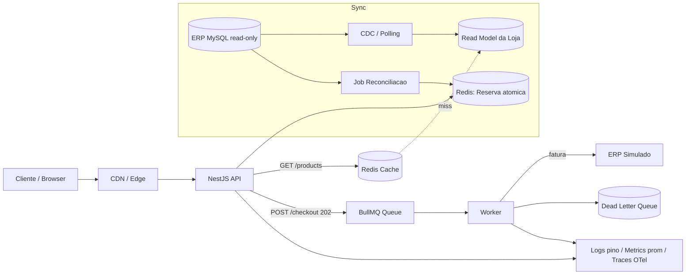
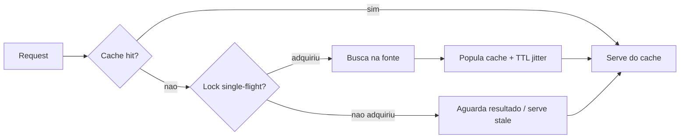
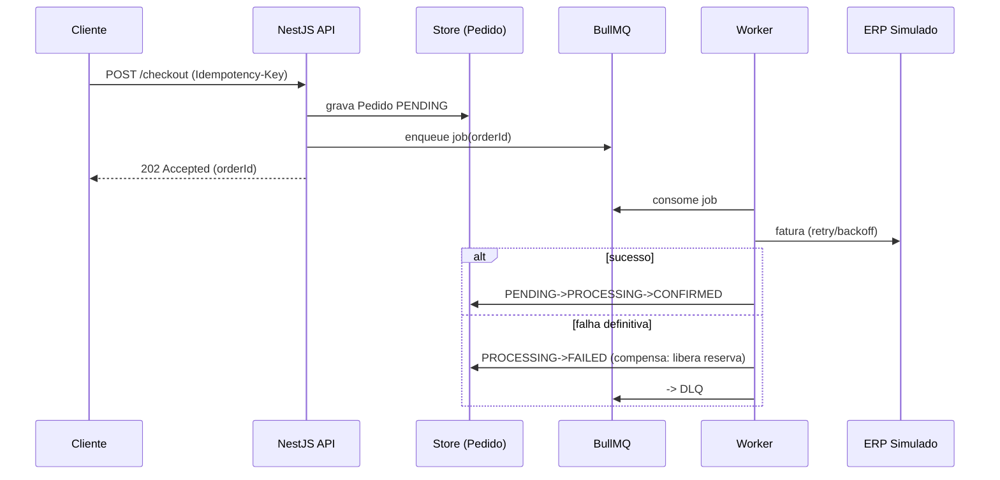
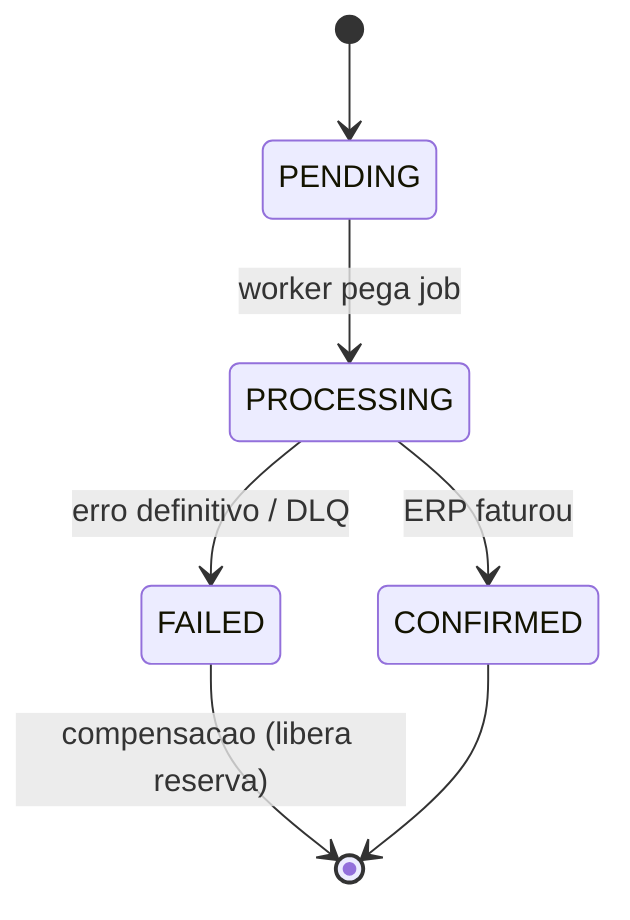

# Respostas Conceituais — Parte 1.A

**Desafio Técnico Pleno Backend — CaseCellShop**

Contexto: varejo de capinhas em hipercrescimento (milhares → milhões de acessos/dia). O ERP Central é um monolito MySQL com **acesso somente leitura** (não podemos alterar tabelas, rotinas ou código). A Loja Virtual hoje consome produtos, preços e estoque **direto do ERP via REST síncrono**. Datacenter próprio, monitoramento básico, baixa rastreabilidade.

As respostas são coerentes com a stack de implementação (Parte 1.B): **NestJS + TypeScript**, arquitetura **hexagonal (ports/adapters)**, **Redis** (cache-aside + TTL + single-flight e reserva atômica via Lua), fila **BullMQ/Redis**, **worker** simulando o ERP com retry/backoff e compensação, **idempotência** via header `Idempotency-Key`, observabilidade com **pino** (logs JSON), **prom-client** (`/metrics`) e **OpenTelemetry** (spans), e **OpenAPI** via `@nestjs/swagger`. Endpoints: `GET /products`, `POST /checkout` (202 Accepted), `GET /orders/{orderId}/status`.

---

## Pergunta 1 — Diagnóstico, trade-offs e arquitetura alvo

### Problema 01 — Performance da vitrine

**(a) Causa raiz.** A vitrine consulta o ERP **a cada acesso**, de forma síncrona e acoplada. O ERP é um monolito transacional otimizado para escrita/contabilidade, não para leitura de alta cardinalidade. Sem cache nem read model, cada pageview vira N chamadas REST ao ERP. O acoplamento síncrono propaga a latência do ERP diretamente ao cliente.

**(b) Impacto.**
- Cliente: vitrine lenta, p95 alto, abandono e conversão menor.
- Negócio: queda de receita, pior posicionamento (Core Web Vitals/SEO), perda em picos (campanhas).
- Operação: ERP sobrecarregado por carga de leitura, contaminando faturamento/financeiro; difícil escalar (read-only, não mexemos no monolito).

**(c) Caminhos.**

| Caminho | Custo | Complexidade | Latência | Consistência | Esforço |
|---|---|---|---|---|---|
| Cache distribuído (Redis cache-aside + TTL) na frente do ERP | Baixo | Baixa | Muito baixa (hit) | Eventual (limitada pelo TTL) | Baixo |
| Read model próprio da loja (projeção sincronizada do ERP) | Médio | Média/Alta | Baixa | Eventual (lag de sync) | Médio/Alto |

**Decisão:** começar por **Redis cache-aside com TTL curto + single-flight** (ganho imediato, baixo esforço) e evoluir para **read model próprio** quando a cardinalidade de queries (filtros, busca, ordenação) e o volume justificarem. São complementares: o read model alimenta o cache.

### Problema 02 — Consistência de estoque (overselling)

**(a) Causa raiz.** A checagem de estoque é um **read-then-write** (consulta o ERP, decide, e o débito real acontece depois/em outro sistema). Entre ler e confirmar há a janela **TOCTOU** (time-of-check to time-of-use): várias requisições leem o mesmo saldo e prosseguem. Como o ERP é read-only para nós, não há reserva atômica na fonte.

**(b) Impacto.**
- Cliente: compra confirmada e depois cancelada → frustração, churn.
- Negócio: chargeback, custo de SAC, dano à marca, prejuízo logístico.
- Operação: conciliação manual, cancelamentos, ruído no ERP.

**(c) Caminhos.**

| Caminho | Custo | Complexidade | Latência | Consistência | Esforço |
|---|---|---|---|---|---|
| Reserva atômica em Redis (Lua DECRBY condicional) com expiração | Baixo | Média | Muito baixa | Forte no ponto de reserva; reconciliada com ERP | Médio |
| Lock pessimista no fluxo de checkout (fila serializada por SKU) | Baixo | Média | Maior (serialização) | Forte | Médio |

**Decisão:** **reserva de estoque atômica em Redis** com TTL de expiração (libera reserva órfã), sincronizando o saldo a partir do ERP (read-only) e **reconciliando** periodicamente. Atomicidade via script **Lua** garante check-and-decrement num único passo, eliminando o TOCTOU.

### Problema 03 — Resiliência do checkout

**(a) Causa raiz.** O faturamento depende de uma chamada **síncrona e lenta** ao ERP dentro da jornada do cliente. Sem timeout/retry/assíncrono, qualquer lentidão do ERP vira erro de checkout. Falta rastreabilidade por pedido.

**(b) Impacto.**
- Cliente: checkout trava, erro no pagamento, duplo clique.
- Negócio: perda de venda no último passo (maior valor).
- Operação: sem rastreio, difícil saber se o pedido foi faturado.

**(c) Caminhos.**

| Caminho | Custo | Complexidade | Latência percebida | Consistência | Esforço |
|---|---|---|---|---|---|
| Checkout síncrono com timeout + retry | Baixo | Baixa | Alta (espera ERP) | Forte | Baixo |
| Checkout assíncrono (fila + worker, 202 Accepted) | Médio | Média | Muito baixa (resposta imediata) | Eventual (status consultável) | Médio |

**Decisão:** **assíncrono**. `POST /checkout` grava o pedido `PENDING` e responde **202 Accepted** com `orderId`; um **worker** (BullMQ) chama o ERP simulado com **retry/backoff + DLQ** e atualiza o status; o cliente acompanha via `GET /orders/{orderId}/status`.

### Visão de arquitetura alvo (30–90 dias)

- **Cache (Redis):** cache-aside com TTL curto na vitrine; single-flight para evitar stampede.
- **Fila/Worker (BullMQ/Redis):** desacopla o faturamento; retry/backoff, DLQ, idempotência.
- **Read model / banco próprio da loja:** projeção de produtos/preços/estoque otimizada para leitura, independente do ERP.
- **Sincronização do MySQL read-only:** preferir **CDC** (ex.: Debezium lendo binlog) quando disponível — não-intrusivo, ideal para read-only; fallback **polling incremental** por `updated_at`/PK; **batch** noturno para reconciliação completa.
- **Observabilidade básica:** logs JSON (pino), métricas Prometheus (`/metrics`), traces OpenTelemetry, correlation IDs ponta a ponta.
- **Reconciliação com o ERP:** job periódico compara reserva/estoque da loja vs ERP, libera reservas órfãs (`PENDING` expirado) e corrige divergências.

---

## Pergunta 2 — Cache, invalidação e performance da vitrine

### Camadas de cache e papel de cada uma

| Camada | Onde | Papel | TTL típico |
|---|---|---|---|
| CDN / Edge | Borda (assets, catálogo público) | Absorve picos, serve HTML/JSON estático e imagens; menor RTT | Minutos a horas |
| API Gateway | Entrada da API | Cache de respostas idempotentes (GET /products), rate limit | Segundos a minutos |
| Aplicação / Redis | Serviço NestJS | Cache-aside dos dados quentes (produto, preço, disponibilidade) | Segundos a minutos |
| Read model | Projeção própria | "Cache materializado" persistente, fonte para repovoar o Redis | Sincronizado por CDC/polling |

### Estratégias

- **TTL:** curto para preço/estoque (mais voláteis), maior para metadados de produto (nome, imagem). TTL com **jitter** (±10–20%) para espalhar expirações.
- **Invalidação:** por evento (CDC dispara invalidação/refresh da chave) e por TTL como rede de segurança. Versionar a chave (`product:{id}:v{n}`) facilita invalidação em lote.
- **Cache-aside vs refresh-ahead:** **cache-aside** (lê do cache; miss → busca na fonte e popula) é o padrão da vitrine — simples e resiliente. **refresh-ahead** (renova proativamente antes de expirar) vale para os top SKUs (alto tráfego), evitando miss em itens quentes.
- **Fallback:** **stale-while-revalidate** (serve dado levemente vencido enquanto revalida em background) e **stale-while-error** (se a fonte/ERP cair, serve o último valor bom em vez de erro). Limitar a idade máxima do stale para não servir dado muito antigo.
- **Cache muito antigo:** limitar `max-stale`, expor `Age` e descartar acima de um teto; CDC reduz a janela de defasagem.
- **Cache stampede:** **single-flight / request coalescing** (uma só busca à fonte por chave; demais aguardam), **lock distribuído curto** na repopulação e **jitter no TTL**. Na implementação, o `GET /products` usa cache-aside com **single-flight** para que um miss simultâneo não dispare N chamadas ao ERP.

### Métricas para validar

**(a) Performance/custo:**
- `cache_hit_ratio` (hits / (hits+misses)) — alvo alto (ex.: > 90%).
- `http_request_duration_seconds` p95/p99 do `GET /products`.
- `erp_calls_total` por request — taxa de offload (quanto o cache poupou do ERP).

**(b) Não está servindo dado velho/incorreto:**
- `cache_staleness_ratio` — fração de respostas servidas como stale.
- `cache_served_age_seconds` (histogram) — idade do dado servido.
- `cache_source_divergence_total` — divergências detectadas entre cache e fonte (amostragem/reconciliação).
- `cache_revalidation_total{result}` — revalidações ok/erro.

---

## Pergunta 3 — Observabilidade (Datadog/Prometheus/OTel)

Objetivo: detectar **degradação** e **furos de estoque** antes das reclamações, sem conta paga (usamos pino + prom-client + OpenTelemetry).

### (a) Logs estruturados (JSON, pino)

Campos **obrigatórios** em todo log:

| Campo | Descrição |
|---|---|
| `timestamp` | ISO 8601 |
| `level` | info/warn/error |
| `service` | nome do serviço |
| `correlationId` / `requestId` | rastreio ponta a ponta (propagado da borda) |
| `traceId` / `spanId` | correlação com OpenTelemetry |
| `route` / `method` | endpoint |
| `statusCode` | resposta HTTP |
| `latencyMs` | duração |

Campos por domínio: `orderId`, `productId`, `qty`, `idempotencyKey`, `cacheResult` (hit/miss/stale), `reservationResult` (ok/insufficient), `erpStatus`, `attempt`, `queueJobId`. **Nunca** logar dados sensíveis (PII de pagamento).

### (b) Métricas

**Cache:** `cache_requests_total{result}` (counter), `cache_hit_ratio` (gauge), `cache_served_age_seconds` (histogram).
**Checkout:** `checkout_requests_total{status}` (counter), `checkout_inflight` (gauge), `checkout_duration_seconds` (histogram).
**Fila/Worker:** `worker_jobs_total{result}` (counter: completed/failed/retried/dlq), `queue_depth` (gauge), `queue_wait_seconds` / `worker_duration_seconds` (histogram), `worker_retries_total` (counter).
**Estoque:** `stock_reservation_total{result=ok|insufficient}` (counter), `stock_available` (gauge por SKU quente), `oversell_prevented_total` (counter).
**ERP:** `erp_calls_total{result}` (counter), `erp_call_duration_seconds` (histogram), `erp_timeouts_total` (counter).

### (c) Traces / spans

`GET /products`:
- `http.request` → `cache.get` → (miss) `lock.acquire` → `readmodel.query` / `erp.fetch` → `cache.set`.

`POST /checkout` (assíncrono):
- `http.request` → `idempotency.check` → `stock.reserve` (Lua) → `order.persist (PENDING)` → `queue.enqueue` → resposta 202.
- Worker (trace separado, ligado por `correlationId`): `worker.process` → `erp.invoice` (com `attempt`) → `order.transition` → (erro) `compensation.release` / `dlq.publish`.

### (d) SLI/SLO, alertas e dashboard

**SLIs/SLOs:**
- Disponibilidade `GET /products` ≥ 99.9%.
- Latência `GET /products` p95 < 200 ms.
- Latência `POST /checkout` (resposta 202) p95 < 300 ms.
- Tempo até confirmação do pedido (enqueue→CONFIRMED) p95 < 30 s.
- `oversell_prevented_total` exposto; saldo nunca negativo (erro hard se ocorrer).

**Alertas:** p95 acima do SLO por 5 min; `cache_hit_ratio` < 80%; `queue_depth` crescente / `queue_wait_seconds` p95 alto; `erp_timeouts_total` em alta; jobs em DLQ > 0.

**Dashboard (painéis):**
1. Tráfego e latência (RPS, p50/p95/p99 por rota).
2. Cache (hit ratio, idade do dado, staleness, offload do ERP).
3. Checkout (taxa de 202, erros, inflight).
4. Fila/Worker (depth, wait, processing, retries, DLQ).
5. Estoque (reservas ok/insuficiente, oversell evitado, saldo dos top SKUs).
6. ERP (latência, timeouts, error rate) — dependência externa.

---

## Pergunta 4 — Concorrência, estoque e idempotência

### Por que read-then-write é insuficiente

`SELECT stock` → aplicação decide → `débito` é uma sequência **não atômica**. Entre o check e o use há a janela **TOCTOU**: duas requisições concorrentes leem `stock=1`, ambas aprovam, ambas debitam → **overselling**. É uma condição de corrida clássica; resolver exige atomicidade ou serialização no ponto de decisão.

### Comparação de mecanismos

| Mecanismo | Como funciona | Prós | Contras | Quando usar |
|---|---|---|---|---|
| Atomic update condicional (`UPDATE ... WHERE stock>=qty` / Redis Lua DECRBY) | Check + decremento num único passo atômico | Sem race; alta performance; simples | Precisa do contador numa fonte controlável (Redis) | **Escolha padrão** — reserva na loja (Redis Lua) |
| Lock pessimista (`SELECT ... FOR UPDATE`) | Bloqueia a linha durante a transação | Forte consistência | Serializa, contenção, deadlock; inviável no ERP read-only | DB transacional próprio, contenção baixa |
| Reserva com expiração | Reserva atômica + TTL; confirma no faturamento | Tolera abandono; libera órfãos | Precisa job de expiração/reconciliação | Checkout assíncrono (nosso caso) |
| Distributed lock (Redlock) | Lock distribuído por chave (SKU) | Serializa cross-instância | Complexo, risco de clock skew, overhead | Seção crítica não-atômica entre serviços; evitar se update atômico resolve |

**Decisão:** **reserva atômica via Redis Lua DECRBY condicional, com TTL de expiração**. O script garante check-and-decrement atômico (resolve TOCTOU sem lock global) e o TTL libera reservas órfãs; a reconciliação com o ERP (read-only) ajusta o saldo base.

### Idempotência

- **Idempotency-Key:** o cliente envia `Idempotency-Key` no `POST /checkout`; o servidor guarda chave → `orderId` num **dedupe store** (Redis `SET NX`). Reenvio com a mesma chave retorna o mesmo pedido, sem criar outro.
- **Duplo clique / retry de rede:** mesma chave → mesma resposta (não duplica reserva nem pedido).
- **Reprocessamento no worker:** jobs idempotentes — a transição de estado é condicional (só avança a partir do estado esperado); reprocessar job já confirmado é no-op.

### Como testaria (no escopo do desafio)

Teste de concorrência: estoque inicial `M`, disparar `N > M` requisições de checkout **em paralelo** para o mesmo SKU.

Asserções:
- Exatamente `M` checkouts obtêm reserva; os outros `N-M` recebem 409 "sem estoque".
- `stock_available` final = 0 (nunca negativo).
- `oversell_prevented_total` reflete as tentativas rejeitadas.
- Repetição com a mesma `Idempotency-Key` não consome estoque adicional.

Implementação: usar os adapters in-memory/Redis da arquitetura hexagonal, `Promise.all` com N requisições e asserções determinísticas no estado final.

---

## Pergunta 5 — Mensageria, resiliência, contrato e IA

### Publicar na fila antes ou depois de gravar o pedido?

**Depois de gravar o pedido (PENDING), nunca antes.** Publicar antes de persistir cria risco de **mensagem-fantasma**: a fila recebe um job para um pedido que pode nunca existir (se a gravação falhar). Persistir antes e enfileirar depois evita isso. O risco residual inverso é o **pedido-fantasma**: pedido gravado mas a publicação falhou — pedido que nunca é processado.

Isso é o **dual-write problem**: gravar no DB e publicar na fila são dois sistemas; sem coordenação podem divergir. A solução canônica é o **padrão Outbox**: na mesma transação grava-se o pedido `PENDING` e um registro `outbox`; um relay publica o outbox na fila com garantia at-least-once. No escopo do desafio (Redis/BullMQ), aproximamos com: **gravar PENDING → enfileirar → reconciliar PENDING órfãos**.

Mitigações de ambos os riscos:
- Gravar pedido **PENDING antes** de enfileirar.
- **Worker idempotente** (at-least-once + dedupe) tolera mensagem entregue mais de uma vez.
- **Reconciliação** periódica varre `PENDING` órfãos (sem job correspondente) e reenfileira ou marca falha.
- **Dead-letter (DLQ)** para jobs que esgotam tentativas.

### Estratégia de retry

- **Backoff exponencial + jitter** (ex.: base 0,5s, fator 2, jitter aleatório) para evitar thundering herd.
- **max attempts** (ex.: 3–5); ao esgotar → **DLQ**.
- Distinguir erros **retriáveis** (timeout, 5xx, indisponibilidade) de **não-retriáveis** (validação) — estes vão direto a `FAILED`.

### Máquina de estados do pedido

Transições **idempotentes** e condicionais (só avança a partir do estado esperado). **Compensação** em `FAILED`: liberar a reserva de estoque e registrar o motivo.

### Papel do OpenAPI no contrato

`@nestjs/swagger` gera o **OpenAPI** como contrato fonte-da-verdade: documenta `GET /products`, `POST /checkout` (202, header `Idempotency-Key`) e `GET /orders/{orderId}/status` (enum de status), com schemas de sucesso e erro. Habilita validação de request/response, geração de clients e testes de contrato — alinha front, back e QA.

### Abordagem de testes

- **Unitários:** lógica de reserva atômica, máquina de estados, idempotência (adapters in-memory).
- **Concorrência:** N>M paralelos sem overselling (Pergunta 4).
- **Integração:** fluxo checkout→worker→status; com Redis/BullMQ via docker-compose (e2e opcional).
- **Resiliência:** simular timeout/erro do ERP → verificar retry, DLQ e compensação.
- **Contrato:** validar respostas contra o schema OpenAPI.

### Uso responsável de IA

- **PROMPTS.md** versionado: registra prompts usados, o que foi gerado por IA e o que foi ajustado manualmente — transparência e reprodutibilidade.
- **Revisão crítica:** toda saída de IA é revisada (corretude, segurança, aderência à arquitetura hexagonal e à stack); nenhum código entra sem entendimento e teste. IA acelera; a responsabilidade de engenharia permanece humana.
