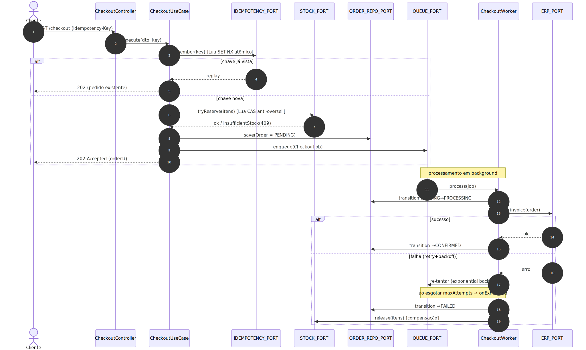

# Diagramas de Arquitetura (SVG) — CaseCellShop

> Versão **portátil** dos diagramas: imagens **SVG** que renderizam em qualquer visualizador (GitHub, VS Code, navegador, PDF), sem depender de suporte a Mermaid. A fonte editável (`.mmd`) fica ao lado de cada imagem; o documento com os blocos Mermaid inline é [`../ARCHITECTURE-DIAGRAM.md`](../ARCHITECTURE-DIAGRAM.md).
>
> Para regenerar os SVGs após editar um `.mmd`: rode `diagrams/render.ps1` (Windows) ou `diagrams/render.sh` (Bash). Requer Node + um Chrome/Chromium instalado.

---

## 1. Visão Hexagonal (Ports & Adapters)

Driving side → núcleo (use cases + domínio + ports) → driven side. As setas `implements` mostram a inversão de dependência: a infra depende dos ports, nunca o contrário.



Fonte: [`diagrams/01-hexagonal.mmd`](diagrams/01-hexagonal.mmd)

---

## 2. Fluxo de Checkout Assíncrono

Idempotência (Lua `SET NX`) → reserva atômica (Lua CAS) → save `PENDING` → enqueue → **202**, com o faturamento no ERP em background (retry/backoff/compensação).



Fonte: [`diagrams/02-checkout-sequence.mmd`](diagrams/02-checkout-sequence.mmd)

---

## 3. Máquina de Estados do Pedido

`PENDING → PROCESSING → CONFIRMED | FAILED`, com a invariante **PROCESSING ↛ PENDING** (anti double-processing).



Fonte: [`diagrams/03-order-state-machine.mmd`](diagrams/03-order-state-machine.mmd)

---

## 4. Resiliência — Outbox lógico + Reconciliação + Compensação

Salvar-antes-de-enfileirar + varredura `@Interval(15000)` que re-enfileira órfãos ou marca `FAILED`+release. Caminhos de falha em vermelho.



Fonte: [`diagrams/04-resilience.mmd`](diagrams/04-resilience.mmd)

---

## 5. Cache-Aside com proteção contra stampede

Hit/miss, single-flight (coalescing anti-stampede), TTL + jitter e stale-on-error.



Fonte: [`diagrams/05-cache-aside.mmd`](diagrams/05-cache-aside.mmd)

---

## Como regenerar

```powershell
# Windows (PowerShell)
./render.ps1
```
```bash
# Bash
./render.sh
```

Os scripts iteram sobre todos os `*.mmd` em `diagrams/` e geram os `*.svg` correspondentes via [`@mermaid-js/mermaid-cli`](https://github.com/mermaid-js/mermaid-cli), usando o `puppeteer.json` local para apontar ao Chrome instalado.
